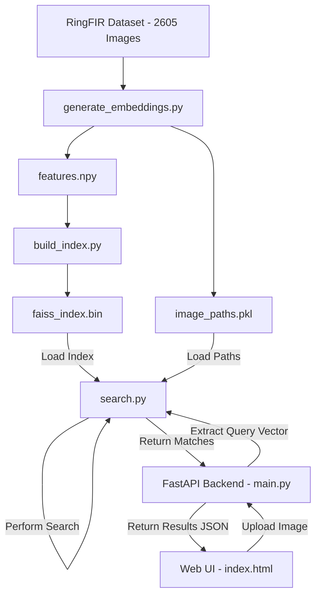

# Aura - AI Jewellery Visual Search System Documentation

Welcome to **Aura**, an AI-powered visual search engine for jewellery. This document explains how the system is built, how to run it, and—most importantly—how the technology works behind the scenes in plain, everyday English.

---

## 🌟 How It Works

Imagine you walk into a massive warehouse containing thousands of different earrings, and you're holding a photo of an earring you love. You want to find similar ones. If you had to look at every single earring in the warehouse one by one, it would take days. 

Aura solves this problem using Artificial Intelligence in three simple steps:

### Step 1: Creating a "Visual Fingerprint" (Feature Extraction)
When a computer looks at an image, it normally just sees a grid of millions of coloured pixels. It doesn't know the difference between a hoop, a diamond, or a background shadow.
* To fix this, we use a pre-trained **AI "Eye"** called **EfficientNetB0**. Think of this AI as a master jewellery designer who has looked at millions of pictures.
* When we show this AI an image, it ignores the raw pixel grid and instead translates the image into a list of **1,280 descriptive numbers**. 
* These numbers describe the visual essence of the design: the curvature, the metal texture, the type of gem setting, the length, etc.
* We call this list of numbers an **embedding** or a **visual fingerprint**.

### Step 2: Organizing the "Digital Warehouse" (FAISS Indexing)
Once we have the visual fingerprints for all 2,605 earrings in our dataset, we need a way to organize them so we can search them instantly.
* We use a tool called **FAISS** (Facebook AI Similarity Search).
* Imagine taking all 2,605 visual fingerprints and plotting them in a giant multi-dimensional map. Earrings that look almost identical will be placed right next to each other on the map, while earrings that look completely different will be placed far apart.
* FAISS builds a highly optimized index (think of it as a super-fast digital filing cabinet) of this map. This database file is called `faiss_index.bin`.

### Step 3: Finding the Perfect Match (Similarity Search)
When you upload a brand new "query" image to the website:
1. The AI instantly looks at your image and creates its **visual fingerprint** (1,280 numbers).
2. It sends this fingerprint to the **FAISS filing cabinet**.
3. FAISS measures the mathematical distance between your image's fingerprint and all the other fingerprints in the map.
4. It identifies the **10 closest neighbours** (the earrings with the shortest distance, meaning they look the most similar).
5. The system converts these mathematical distances into a clean percentage score (e.g. "98.5% Match") and displays them on your screen.

---

## 🛠️ The Software Architecture

Here is how the code is organized to make this happen:




---

## 💻 Developer Guide: The Files Explained

### 1. `generate_embeddings.py`
* **What it does**: This is the script that scans your raw image folder (`data/RingFIR`) and extracts the visual fingerprints.
* **Key settings**: It resizes all images to 224x224 pixels and feeds them to the pre-trained EfficientNetB0 network without training it (saving time and computational power).
* **Outputs**:
  * `features.npy`: A binary file containing all the 1,280-digit fingerprints.
  * `image_paths.pkl`: A index file linking each fingerprint back to its original image file path.

### 2. `build_index.py`
* **What it does**: This script reads the fingerprints (`features.npy`) and builds the FAISS vector search database.
* **Output**:
  * `faiss_index.bin`: A high-performance index file used for instant retrieval.

### 3. `search.py`
* **What it does**: This is the search engine module. It contains the Python class `JewellerySearchEngine`.
* **How to use in terminal**: You can run a test query directly from your command line:
  ```bash
  python search.py data/RingFIR/001/001_001.png
  ```

### 4. `main.py`
* **What it does**: This script starts the FastAPI web server. It acts as the bridge connecting your Python search engine to the web browser.
* **Features**:
  * Accepts image uploads at `/search`.
  * Protects against bad files (makes sure they are images).
  * Automatically mounts and serves the static images inside `data/RingFIR` and the frontend page.

### 5. `frontend/` (Web Application)
* [index.html](file:///Users/tgsaytan/Project/jewllery_website/frontend/index.html): Standard HTML5 structure featuring a modern single-page design.
* [style.css](file:///Users/tgsaytan/Project/jewllery_website/frontend/style.css): A premium CSS stylesheet designed with **glassmorphism** (semi-transparent frosted-glass containers) and a rich dark mode accented with luxury champagne gold (`#c5a880`).
* [app.js](file:///Users/tgsaytan/Project/jewllery_website/frontend/app.js): Modern JavaScript that controls the file drag-and-drop mechanism, manages loading animations, makes requests to the FastAPI backend, and renders the result cards dynamically.

---

## 🚀 Step-by-Step Run Instructions

If you ever need to set this up from scratch on another machine, run these commands in order:

```bash
# Activate virtual environment
source .venv/bin/activate

# 1. Install all dependencies
pip install -r requirements.txt

# 2. Generate the visual fingerprints (Embeddings)
python generate_embeddings.py

# 3. Build the search index
python build_index.py

# 4. Start the server
python main.py

# Decative virtual environment
deactivate

```

Open **`http://localhost:8000`** in your browser and upload any earring image to see it in action!
