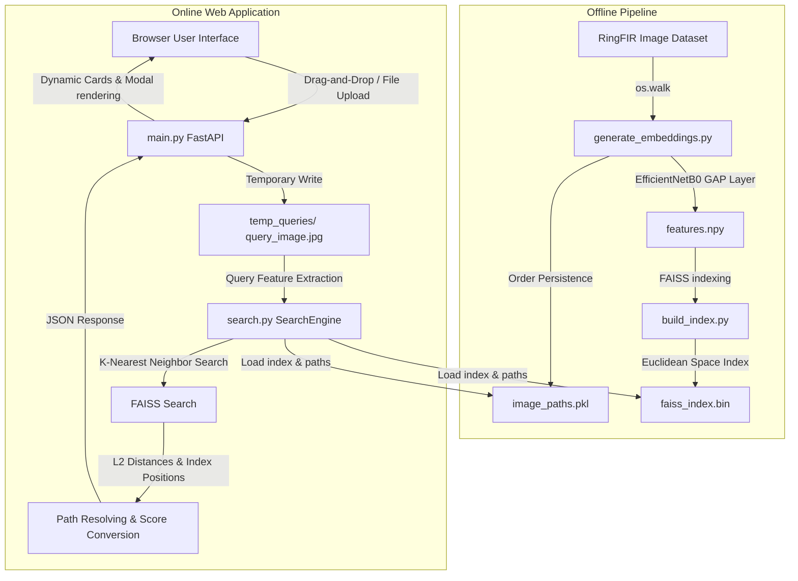

# Aura System: Developer Guide & System Architecture

Aura is an AI-powered visual search system designed specifically for jewellery (starting with earring designs from the RingFIR dataset). Rather than relying on traditional text description tags (which are subjective and prone to vocabulary mismatch), Aura allows users to search using visual content. It translates uploaded image patterns into numerical vectors and retrieves the most similar inventory items in real time.

This guide provides a comprehensive overview of how the system is structured, the technology stack, the mathematics of similarity, and how each file contributes to the overall system.

---

## 1. System Architecture Overview

The system is separated into two primary workflows:
1. **Offline Phase (Preprocessing)**: Ingests the raw dataset, extracts visual vectors using deep learning, and indexes them using a high-performance vector search database.
2. **Online Phase (Runtime)**: Runs the FastAPI web application, handles query image uploads, computes query embeddings, queries the vector database, and dynamically presents results to the user.

### End-to-End Data Flow



---

## 2. Core Technologies

- **EfficientNetB0**: A convolutional neural network architecture developed by Google Brain. It is optimized to perform highly efficient feature extraction with 5.3 million parameters (compared to VGG's 138 million), outputting a compact 1,280-dimensional embedding vector representing visual features like gemstones, edges, metals, and shapes.
- **FAISS (Facebook AI Similarity Search)**: Meta's open-source library built for nearest-neighbor search on dense vectors. The flat index (`IndexFlatL2`) performs exhaustive L2 searches at sub-millisecond speeds.
- **FastAPI**: An asynchronous, highly concurrent web framework in Python that handles endpoint validation, image streaming, and static assets serving.
- **Vanilla ES6+ JavaScript, CSS3, & HTML5**: The presentation tier built with glassmorphism style sheets (luxury dark aesthetic with champagne gold accents) supporting responsive layout grids and detail view modals.

---

## 3. Step-by-Step Code Walkthrough

### Step 3.1: Feature Extraction Pipeline
The file [generate_embeddings.py](file:///Users/tgsaytan/Project/jewllery_website/generate_embeddings.py) processes the dataset:

- It loads **EfficientNetB0** pre-trained on ImageNet with `include_top=False` (removing the classification head) and `pooling='avg'` (applying Global Average Pooling) to directly yield a 1,280-element array.
- It iterates through the dataset at `data/RingFIR` in batches of 32 for performance.
- Each image is resized to `224x224` pixels and normalized using `preprocess_input`.
- The outputs are saved into:
  - [features.npy](file:///Users/tgsaytan/Project/jewllery_website/features.npy): Embeddings matrix of shape `(2605, 1280)`.
  - [image_paths.pkl](file:///Users/tgsaytan/Project/jewllery_website/image_paths.pkl): Pickled list of matching file paths in index order.

### Step 3.2: Building the Vector Index
The file [build_index.py](file:///Users/tgsaytan/Project/jewllery_website/build_index.py) loads the embeddings and creates a FAISS index:

```python
# Create L2 Flat index with 1280 dimensions
index = faiss.IndexFlatL2(dimension)
# Add all dataset embeddings
index.add(embeddings)
# Persist index to file
faiss.write_index(index, index_file)
```
The output is saved as [faiss_index.bin](file:///Users/tgsaytan/Project/jewllery_website/faiss_index.bin). This index flat-maps vectors in L2 space for fast distance queries.

### Step 3.3: The Search Engine Core
The engine resides in [search.py](file:///Users/tgsaytan/Project/jewllery_website/search.py) under the [JewellerySearchEngine](file:///Users/tgsaytan/Project/jewllery_website/search.py#L9-L81) class.

1. **`__init__`**: Loads the pre-trained EfficientNetB0 model, the FAISS index (`faiss_index.bin`), and the ordered file path catalog (`image_paths.pkl`).
2. **`extract_features`**: Computes the embedding vector for the query image.
3. **`search`**: Queries the index with `index.search(query_vector, k)` to fetch the top 10 items.

> [!NOTE]
> **Distance-to-Similarity Conversion**:
> FAISS outputs the raw Euclidean L2 distance ($d$). To present this as an intuitive similarity score ($S$) in percentage format, we apply the mapping:
> $$S = \frac{1}{1 + d} \times 100$$
> - A distance of $d = 0.0$ translates to a $100\%$ match.
> - Larger distances progressively scale similarity down towards $0\%$.

### Step 3.4: Web API Backend
The FastAPI server is defined in [main.py](file:///Users/tgsaytan/Project/jewllery_website/main.py).

- **Startup Event**: Automatically loads the search engine into memory so that subsequent search requests run completely in RAM with no vector index reload overhead.
- **Static Mounts**: Exposes `/data` (to stream database images) and `/frontend` (to serve assets), as well as `/temp` (to store query previews).
- **`/search` Endpoint**:
  1. Accepts file uploads via `UploadFile`.
  2. Asserts that the MIME type is an image.
  3. Writes the query temporarily to the [temp_queries/](file:///Users/tgsaytan/Project/jewllery_website/temp_queries) folder.
  4. Feeds the file path to [JewellerySearchEngine.search](file:///Users/tgsaytan/Project/jewllery_website/search.py#L57-L81).
  5. Formats the results into a JSON schema consisting of image paths, distances, and similarity percentages.

### Step 3.5: User Interface Logic
The frontend logic resides in [frontend/app.js](file:///Users/tgsaytan/Project/jewllery_website/frontend/app.js):

- **Drag & Drop Events**: Listens to drag activity on the upload card.
- **FileReader API**: Generates a base64 DataURL representing the image immediately on selection to render a local preview before initiating network requests.
- **Asynchronous Search Call**: Uses `fetch('/search')` to dispatch the file payload as multipart/form-data.
- **Dynamic DOM Rendering**: For each result item returned:
  - Generates a styled `.result-card` container.
  - Formats labels dynamically (e.g., converting `001_002.png` into `Earring 001 #002`).
  - Sets up click listeners. Clicking a card opens a modal overlay presenting high-resolution views and exact similarity/distance numbers.

---

## 4. Execution Command Reference

If you need to run the pipeline manually, execute the following commands in the project directory:

```bash
# 1. Install dependencies
pip install -r requirements.txt

# 2. Process RingFIR dataset to extract 1280-dim feature vectors
python generate_embeddings.py

# 3. Compile FAISS vector database bin file
python build_index.py

# 4. Launch the local FastAPI application server
python main.py
```

After launching the server, visit [http://localhost:8000](http://localhost:8000) in your browser to interact with the visual search website.
